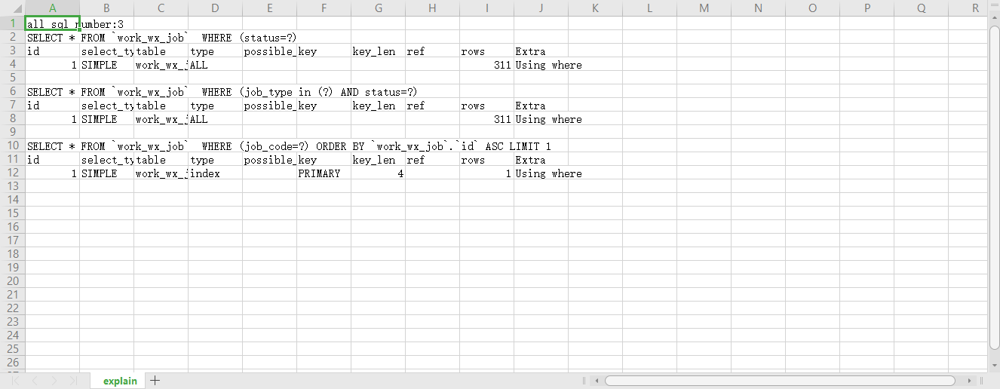
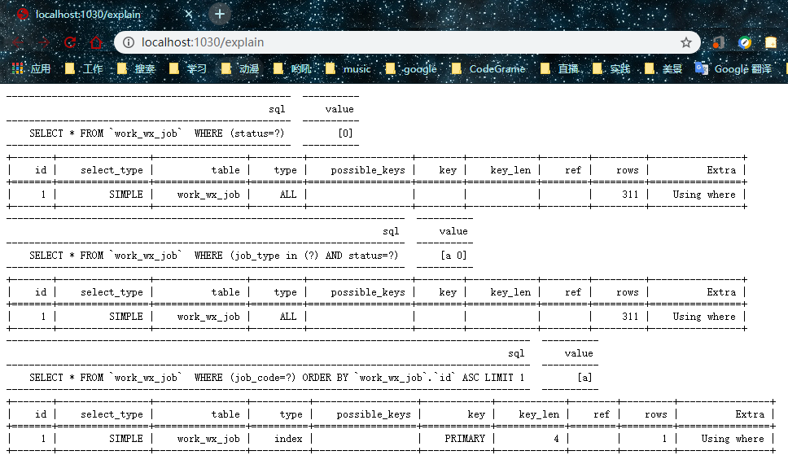

# gorm-explain

利用Gorm Callback在执行Select SQL之后再执行 Explain SQL
，之后将结果以不同的方式输出。现在支持控制台，csv文件，浏览器。

## 输出

### 控制台

**code:**
```text
func TestExplain(t *testing.T) {
    // 初始化db
    dao := db.InitDebug(&db.MysqlConfig{})

    // ExplainOutDefault 在控制台输出
    SqlExplain(dao.db, 3, ExplainOutDefault)
    // 输出
    defer OutExplain()
    // 下面为需要查看explain的方法
    dao.GetWorkXx(0)
    dao.GetWorkXxx(0, "a")
    dao.GetWorkXxx("a")
}
```

**结果:**

<p align='center'>
    
</p>


### CSV

**code:**
```text
func TestExplain(t *testing.T) {
    // 初始化db
    dao := db.InitDebug(&db.MysqlConfig{})

    // ExplainOutCsv 输出csv文件
    SqlExplain(dao.db, 3, ExplainOutCsv)
    // 输出
    defer OutExplain()
    // 下面为需要查看explain的方法
    dao.GetWorkXx(0)
    dao.GetWorkXxx(0, "a")
    dao.GetWorkXxx("a")
}
```

**结果:**



### Web

**code:**
```text
func TestExplain(t *testing.T) {
    // 初始化db
    dao := db.InitDebug(&db.MysqlConfig{})

    // ExplainOutWeb 输出到浏览器
    SqlExplain(dao.DB, 3, ExplainOutWeb)
    // 输出
    defer OutExplain()
    // 下面为需要查看explain的方法
    dao.GetWorkXx(0)
    dao.GetWorkXxx(0, "a")
    dao.GetWorkXxx("a")
}
```

**结果:**



## 支持

- MySQL

## 感谢

[gotabulate](http://github.com/bndr/gotabulate)

[gorm](http://github.com/jinzhu/gorm)

[kyokomi/gorm-explain](https://github.com/kyokomi/gorm-explain)

## License

Licensed under the MIT license.